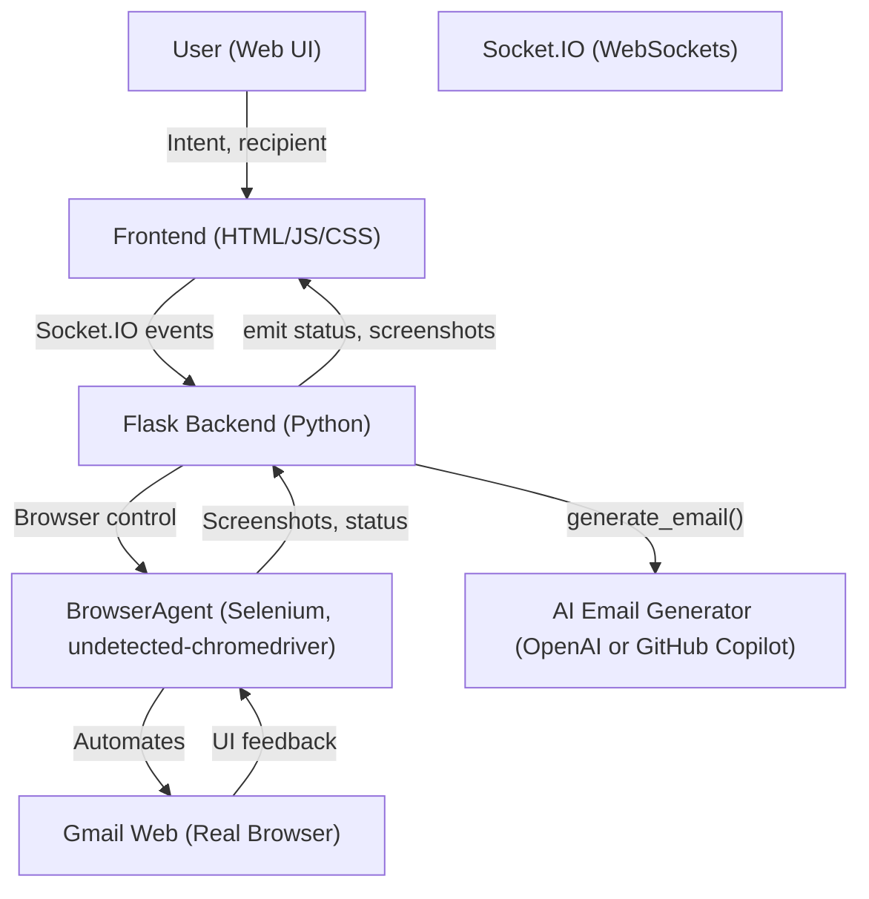
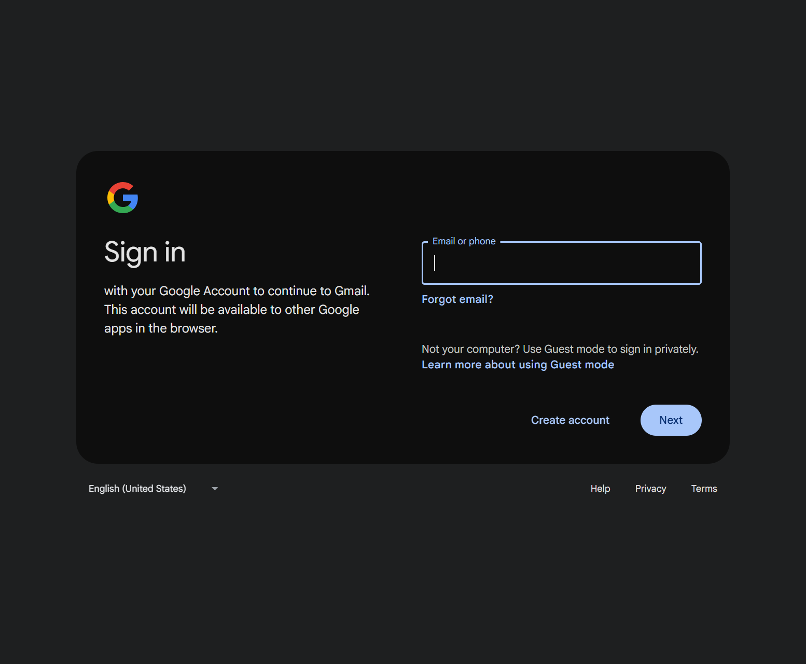
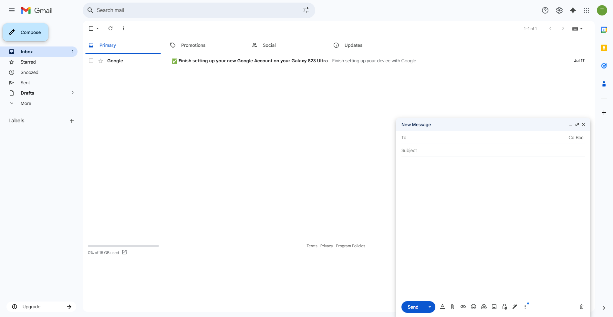
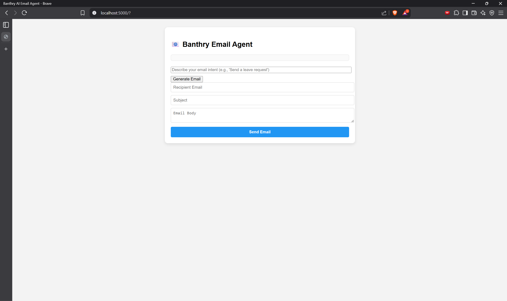

Here’s a comprehensive outline and content for your `README.md` that covers all your requirements. You can copy this directly, and I’ll also provide a Mermaid diagram for the architecture.

---

# Banthry AI Email Agent

## 📦 Overview

Banthry AI Email Agent is a full-stack, real-time browser automation system that lets users generate and send professional emails via Gmail—**without using any Gmail APIs**. Instead, it controls a real browser (via Selenium) to mimic human actions, and uses AI (OpenAI or GitHub Copilot/ChatGPT 4.1) to generate email drafts from user intent.

---

## 🏗️ Architecture



---

## 🚦 Browser Automation, Not APIs

**This project does NOT use Gmail APIs.**  
Instead, it launches a real Chrome browser (headless or visible) and automates all actions (login, compose, send) by simulating human input. This approach works even if Gmail APIs are restricted or unavailable.

---

## ⚙️ How Browser Control Works

- **Selenium + undetected-chromedriver**: Launches a Chrome browser that is less likely to be detected as a bot.
- **Step-by-step automation**: The agent enters your email, password, clicks buttons, fills forms, and sends emails just like a human.
- **Screenshots**: At every important step, screenshots are taken and streamed to the frontend for real-time feedback.
- **Error handling**: If Google shows a CAPTCHA or blocks automation, the user is notified with screenshots and status messages.

---

## 🛠️ Technology Choices & Justifications

- **Python (Flask, Socket.IO)**: Simple, robust backend with real-time communication.
- **Selenium + undetected-chromedriver**: Best for browser automation with minimal detection.
- **OpenAI or GitHub Copilot/ChatGPT 4.1**: For high-quality, context-aware email generation.
- **HTML/CSS/JS Frontend**: Lightweight, real-time chat-like UI.
- **Socket.IO**: Real-time, bidirectional communication for status and screenshots.

---

## 🚀 Setup & Running Instructions

### 1. **Clone the Repository**
```sh
git clone https://github.com/yourusername/banthry_browser_agent.git
cd banthry_browser_agent
```

### 2. **Install Python Dependencies**
```sh
python -m venv venv
source venv/bin/activate  # or venv\Scripts\activate on Windows
pip install -r requirements.txt
```

### 3. **Install Node.js Dependencies (for socket.io-client)**
```sh
npm install socket.io-client
```

### 4. **Set Up Environment Variables**
Create a `.env` file in the `backend/` folder:
```
GMAIL_USER=your_gmail@gmail.com
GMAIL_PASS=your_gmail_password
GITHUB_TOKEN=ghp_xxx  # For GitHub Copilot/ChatGPT 4.1
# or
OPENAI_API_KEY=sk-xxx # For OpenAI
```

### 5. **Run the Backend**
```sh
cd backend
python main.py
```

### 6. **Open the Frontend**
Go to [http://localhost:5000/](http://localhost:5000/) in your browser.

---

## 🖼️ Screenshots

### **Login Step**


### **Email Compose**


### **Real-Time Status**


*(Add your own GIFs/screenshots of the browser being controlled!)*

---

## 💡 Challenges & Solutions

- **Gmail Bot Detection**:  
  *Solution*: Used `undetected-chromedriver`, human-like typing, and random delays to mimic real users.

- **Password Field Issues**:  
  *Solution*: Waited for the field to be interactable, focused and cleared before typing, and avoided double-typing.

- **AI Quota/Key Issues**:  
  *Solution*: Supported both OpenAI and GitHub Copilot/ChatGPT 4.1 for flexibility.

- **Real-Time Feedback**:  
  *Solution*: Streamed status and screenshots via Socket.IO for a transparent user experience.

- **Frontend/Backend Sync**:  
  *Solution*: Used Socket.IO events for all communication, ensuring the UI always reflects backend progress.

---

## 📚 Folder Structure

```
banthry_browser_agent/
├── backend/
│   ├── main.py
│   ├── browser_agent.py
│   ├── email_generator.py
│   └── ...
├── frontend/
│   ├── index.html
│   ├── style.css
│   ├── socket.js
│   └── ...
├── screenshots/
│   └── *.png
├── .env
├── requirements.txt
└── README.md
```

